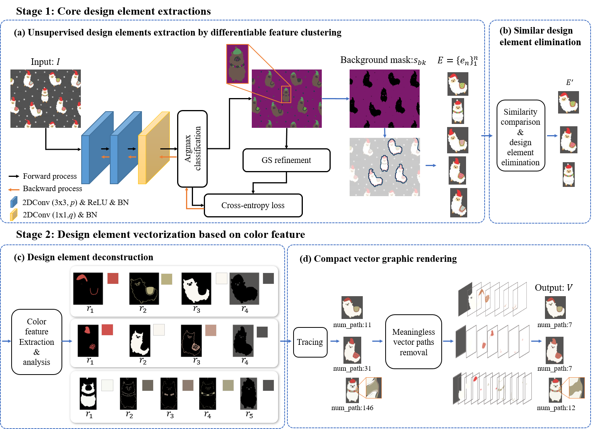
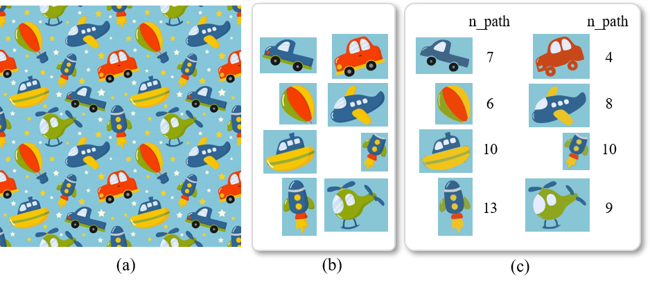

# Recycling/Upcycling Graphic Design - Automatic Design Elements Extraction and Vectorization
This repository contains code and materials for the paper _Upcycling Graphic Design - Automatic Design Elements Extraction and Vectorization_, contributed by Hong QU, K. P. Chau, and P. Y. Mok*. All rights reserved by authors.

-----
## Introduction
A graphic design image can be considered as an arrangement of design elements filled with specific colors according to certain layout rules. This study focuses on
developing an automatic pipeline to identify and extract core design elements from any unknown input design images, and it also converts the extracted design elements to a
neat vector format with a new optimization algorithm. More specifically, an unsupervised learning technique is applied for core design element extraction to
address the problem of no available dataset on labeled designs. Next, a novel design element vectorization method is proposed based on color features. Extensive
experiments have demonstrated the effectiveness of the proposed method on design image processing. The proposed method can process, namely extract and vectorize,
core design elements of an unknown image within around 29 seconds. The output vector graphics of design elements have very compact format, compared to other
commercial software, and are optimized for reuse and re-editing.

## Datasets
Test images can be found at: 链接：https://pan.baidu.com/s/1H6Xh0LnLToJoCYW8DY7jYA?pwd=yikl 提取码：yikl

## Configuration file
Please see the _requirements.txt_
